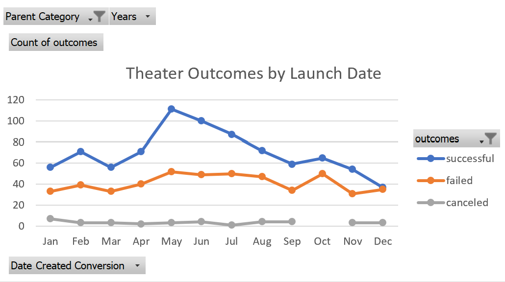

# Kickstarting with Excel (Module 1 - Challenge) : KickStarter 

## Overview of Project - KickStarter Data Analysis for Crowdfunding
	Analyzing Data for Louise, an upcoming play writer, in order for her to create a crowdfunding campaign to help fund her play "Fever".

### Purpose - 
	The budget estimation for the play "Fever" by Louise is $10,000. In order to make the project campaign successful, we need to analyze the data that matches this criteria. Getting a better understanding of how projects related to the same category have been funded in the past. Understanding the key factors responsible for the success of the past projects will greatly help Louise to successfully launch her project. 

## Analysis and Challenges
In the excel file KickStarter_Challenge file, we have data available for various KickStarter campaigns across countries, different categories and the goal and pledged values.
	
Hence will be using the above parameters to help Loiuse conclude as to what changes she needs to make to her campaign in order to make the campaign successful

### Deliverable 1 : Analysis of Outcomes Based on Launch Date -
As Louise's play "Fever" has come close to its fundraising goal, we will be analyzing data of different campaigns fared in relation to their launch dates.
	
As we analyze the data based on launch dates in the category of theater, we discovered that the projects launched from May to August were likely to be more successful than other months. Projects were more likely to fail towards the end of the year.

### Deliverable 2 : Analysis of Outcomes Based on Goals -
We want to make sure that the estimation made by Louise was appropriate. Hence a comparision in relation to the range of the funding goals is required to get a better picture of how likely it is for Louise campaign to be fully funded. 
 	
As a result of this analysis, it was discovered that more that 66% of projects were successfully funded. And out of these 66% projects, 76% projects had goal range of under $4999. 34% of the projects failed due to higher goals.

### Challenges and Difficulties Encountered -
1. Validation of Data : Ensuring that the data wasn't accidentally altered throughout the analysis was one of the biggest challenges of performing this analysis on Excel.

In order to make sure that the data wasn't modified or altered, a separate sheet with the original data was created which was used frequently as a checking tool to compare the totals in the goal and pledged columns to ensure that data used was completely acccurate. 

2. Though we are able to derive the percentage of campaigns that failed, we still do not have a clear picture about the reason of the failure. The reason of the failure could be either the timing of the launch or the higher goal amount or the preferences of the pledgers.

## Results

- What are two conclusions you can draw about the Outcomes based on Launch Date?

1. Conclusion 1 : From the above analysis based on launch date, we can conclude that the projects in theater category launched during the earlier part of the year i.e. May to August are more likely to be successful.

So the launch date should be planned from anytime between May to August.

2. Conclusion 2 : As the months from May to August are between spring and summer, we can also conclude that most of the pledgers look for activities to do during these months and hence this output could be seasonal.

- What can you conclude about the Outcomes based on Goals?
From the analysis based on outcomes, its concluded that the project goal should be under $5000 or less in order to be atleast 70% successful.

- What are some limitations of this dataset?
The main and biggest limitation of the data set is the actual reason of the failure of the project. There could be various reasons for failure like preferences of pledgers, the time of the project, previous history of the launching organization, cultural differences of the pledgers in different countries, age of the pledgers, the state of the economy of the country during the launch, the buying power of the pledgers.

- What are some other possible tables and/or graphs that we could create?
1. A bar graph which gives comparison of the outcomes based on goals as well as pledged can easily display the difference between the two parameters.
2. A line graph to show the outcomes based on the pledged and based on the percentage funded.